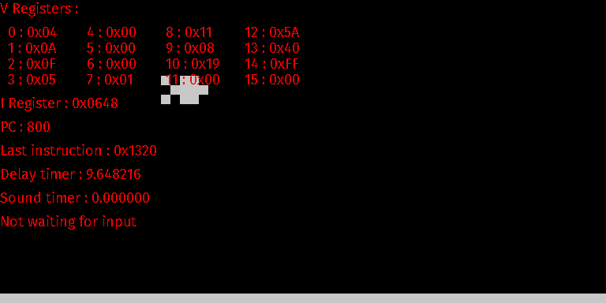

# chip8-emulator

A [chip-8](https://en.wikipedia.org/wiki/CHIP-8) emulator made for educational purposes in C.

The exemple programs come from [mattmikolay's repository](https://github.com/mattmikolay/chip-8)
wich was my main source of documentation for this project.

## Launching
The project was made using the [xmake](https://xmake.io/) build tool, which needs to be installed.
Compile the emulator with the `xmake` command.

You can then run a program with with the command :
`xmake run chip-8 <program-path.ch8>`.

The program path is relative to the executable file (found in the `build` directory),
so it's probably easier to give the absolute path of the program to be ran,
except when its in the `exemple_programs` directory : it is soft-linked at compile time, so for its programs
you can juste give the path as `./exemple_programs/...`. The programs end with the 
`.ch8` extension.

### Windows
On windows, xmake's SDL2 package only works on MinGW. Install the toolchain and run `xmake f -p mingw --sdk=<sdk-path>`
before compilation.

## Debugger
Press the `Space` key to toogle the debugger. It shows information concerning 
the registers, the pointer counter, the timers...

Screenshot (with the `chipquarium` exemple) :


## Input
The keys are mapped to the following keys in order to match the original layout's key positions.
The key mapping is implemented using scancodes and thus works on any layout (azerty...),
following the **key positions** not their names.
```
eg. Qwerty layout       Virtual layout
╔═══╦═══╦═══╦═══╗     ╔═══╦═══╦═══╦═══╗
║ 1 ║ 2 ║ 3 ║ 4 ║     ║ 1 ║ 2 ║ 3 ║ C ║
╠═══╬═══╬═══╬═══╣     ╠═══╬═══╬═══╬═══╣
║ Q ║ W ║ E ║ R ║     ║ 4 ║ 5 ║ 6 ║ D ║
╠═══╬═══╬═══╬═══╣ --> ╠═══╬═══╬═══╬═══╣
║ A ║ S ║ D ║ F ║     ║ 7 ║ 8 ║ 9 ║ E ║
╠═══╬═══╬═══╬═══╣     ╠═══╬═══╬═══╬═══╣
║ Z ║ X ║ C ║ V ║     ║ A ║ 0 ║ B ║ F ║
╚═══╩═══╩═══╩═══╝     ╚═══╩═══╩═══╩═══╝
```

